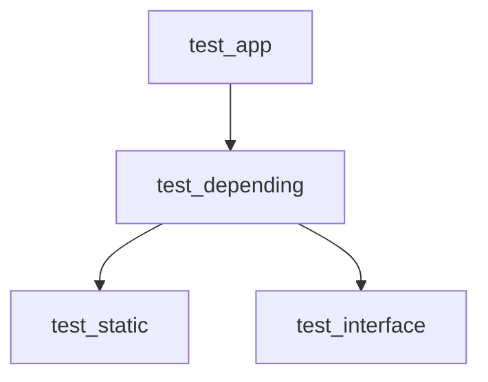

# CMake のパッケージの依存関係の解決サンプル

CMake を利用したライブラリで、find_package() により参照されたパッケージがさらに別のパッケージをfind_package() で参照している場合の依存先パッケージの解決についてのサンプルプロジェクトです。

このサンプルプロジェクトはWindows 環境を想定しています。

## モジュールの依存関係



test_static はスタティックライブラリです。

test_interface はヘッダのみのライブラリです。

test_depending はtest_static, test_interface に依存しているスタティックライブラリです。

test_app はtest_depending を利用するアプリケーションです。

それぞれ別々のCMake プロジェクトになっています。

## ライブラリのインストール先

このプロジェクトの各ライブラリは、ビルド後に```cmake --install``` コマンドでインストールを行います。

インストールしたライブラリを他のプロジェクトから利用する場合、CMakeLists.txt で```find_package(パッケージ名)``` を使用します。このコマンドは[Config Mode Search Procedure](https://cmake.org/cmake/help/latest/command/find_package.html#config-mode-search-procedure) で説明されているルールに沿って```パッケージ名-config.cmake``` という名前のファイルを探して実行します。

Windows 環境の場合、デフォルトのインストール先は```c:/Program Files/${PROJECT_NAME}``` となりますが、都合の悪い場合も多いため環境変数などで変更します。このプロジェクトでは、この README.md と同じ階層に```shared``` というディレクトリを作成し、各プロジェクトのライブラリをまとめてインストールします。

ライブラリのインストールはCMakeLists.txt 内の```install()``` コマンドで制御します。また```install(EXPORT)``` コマンドにより```パッケージ名-config.cmake``` ファイルも生成します。利用側プロジェクトの```find_package()``` で```パッケージ名-config.cmake``` を見つけられるようなインストール配置になるよう```cmake --install``` コマンドの```--prefix``` オプションと```install()``` の```DESTINATION``` オプションを指定します。

結果として、例えばtest_depening からtest_static を利用する場合には次のような指定となりました。(CMakeLists.txt やバッチファイルから一部を抜粋)

```cmake
# test_static のCMakeLists.txt
install(
    EXPORT test_static-config
        NAMESPACE test_static::
        DESTINATION lib/cmake/test_static
)
```

```bat
cmake --install test_static/build --prefix=%CD%\shared\test_static
```

```
# ディレクトリ構成
+---shared
|   +---test_static
|       +---include
|       +---lib
|           +---cmake
|               +---test_static
|                   +---test_static-config.cmake
+---test_depending
+---test_static
```

```cmake
# test_depending のCMakeLists.txt
find_package(test_static)
target_link_libraries(
    test_depending
        PRIVATE
            test_static::test_static
)
```

```bat
set CMAKE_INSTALL_PREFIX=%CD%\shared
cmake -S test_depending -B test_depending/build
```

## 依存先の依存先パッケージのためのfind_package()

このプロジェクトの```test_app``` が直接利用しているのは```test_depending``` だけです。しかし、test_app のCMakeLists.txt に```find_package(test_depending)``` だけを記述した場合、エラーとなります。

```
  The link interface of target "test_depending::test_depending" contains:

    test_static::test_static

  but the target was not found.  Possible reasons include:

    * There is a typo in the target name.
    * A find_package call is missing for an IMPORTED target.
    * An ALIAS target is missing.
```

test_app のCMakeLists.txt に```find_package(test_static)```, ```find_package(test_interface)``` を追加すれば解決しますが、間接的な参照先の分まで```find_package()``` を指定しなければならないのは不便です。

参考のためlibclang がどうなっているのかを見てみました。llvm-project のClang はLLVM に依存していますが、```find_package(Clang)``` だけでlibclang が利用できるようになっています。

ソースコードからビルドした```lib/cmake/clang/ClangConfig.cmake``` の内容を見たところ、```find_package(LLVM)``` が含まれていました。この```ClangConfig.cmake``` はCMake の機能ではなくllvm-project 側で作成しているようです。

一方で```install(EXPORT)``` で生成した```test_depending-config.cmake``` には```find_package()``` は含まれていません。

CMake の機能で解決する方法がないか調べてみたところ```install(EXPORT)``` に[EXPORT_PACKAGE_DEPENDENCIES](https://cmake.org/cmake/help/v3.30/command/install.html#export) オプションが用意されていました。このオプションを指定すると依存するパッケージを探すための```find_dependency()``` が```パッケージ名-config.cmake``` に追加されます。```find_dependency()``` が依存先を見つけるためには、パッケージが検索可能なパスに配置されている必要があります。そのため依存するライブラリを```CMAKE_INSTALL_PREFIX``` で指定するディレクトリ以下にまとめて、```パッケージ名-config.cmake``` は```${CMAKE_INSTALL_PREFIX}/パッケージ名/lib/cmake/パッケージ名``` に配置するとうまくいきます。


なお、CMake 3.31 の時点で```EXPORT_PACKAGE_DEPENDENCIES``` オプションは実験的機能で、```CMAKE_EXPERIMENTAL_EXPORT_PACKAGE_DEPENDENCIES``` が必要という記載があります。しかし、```set(CMAKE_EXPERIMENTAL_EXPORT_PACKAGE_DEPENDENCIES TRUE)``` や```cmake -DCMAKE_EXPERIMENTAL_EXPORT_PACKAGE_DEPENDENCIES=TRUE``` など試してもうまく動きません。

CMake のソースコードを確認したところ、内部で定義している実験的機能ごとのUUID の値を設定しておく必要があるようでした。実際に```set(CMAKE_EXPERIMENTAL_EXPORT_PACKAGE_DEPENDENCIES ソースコードからコピーしたUUID の値)``` とすると動作しました。UUID の値は定期的に変更される、とソースコード中のコメントに記述があるため利用時には確認が必要そうです。